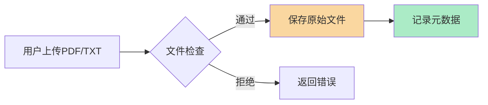
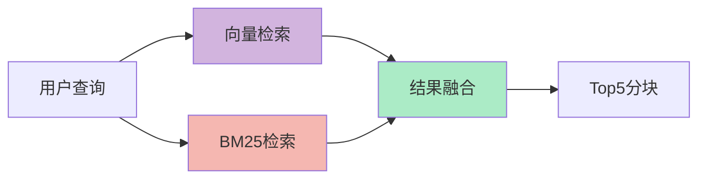
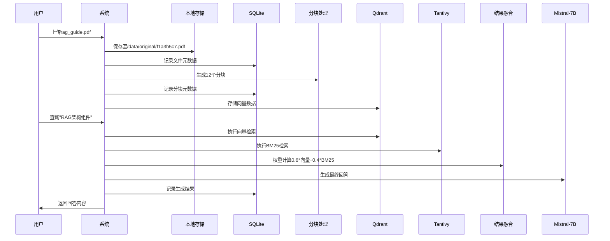

# RAG 全流程数据流转详解（MVP 简化版）

## 一、核心流程总览


## 二、详细数据流转说明

### 1. 文件上传阶段



**数据存储实现**：

```bash
# 本地存储结构
./data/
├── original/  # 原始文件存储
│   └── f1a3b5c7.pdf
└── chunks/     # 分块存储（可选）
```

```sql
/* SQLite文件表结构 */
CREATE TABLE files (
    file_id TEXT PRIMARY KEY,
    file_name TEXT NOT NULL,
    file_size INTEGER CHECK(file_size < 52428800), -- 50MB限制
    storage_path TEXT NOT NULL,
    created_at DATETIME DEFAULT CURRENT_TIMESTAMP
);
```

### 2. 分块处理阶段


**分块参数示例**：

```python
{
    "window_size": 512,  # 字符数
    "overlap": 128,      # 重叠字符
    "strategy": "sliding_window"
}
```

**数据存储实现**：

```sql
/* 分块表结构 */
CREATE TABLE chunks (
    chunk_id TEXT PRIMARY KEY,
    file_id TEXT NOT NULL,
    content TEXT NOT NULL,
    start_offset INTEGER CHECK(start_offset >= 0),
    end_offset INTEGER CHECK(end_offset > start_offset),
    FOREIGN KEY(file_id) REFERENCES files(file_id)
);
```

### 3. 向量转换阶段


**向量存储结构**：

```bash
# Qdrant本地存储
qdrant/
└── collections/
    └── rag_collection/
        ├── data/          # 向量数据
        └── payload/       # 元数据关联
```

**向量记录示例**：

```json
{
    "id": "v1b2c3d4",
    "vector": [0.12, -0.34, ..., 0.56],
    "payload": {
        "chunk_id": "c1b2a3d4",
        "file_id": "f1a3b5c7"
    }
}
```

### 4. 混合检索阶段



**检索日志存储**：

```bash
# 检索日志示例
./logs/search/2024-04-25.log
```

```json
{
  "timestamp": "2024-04-25T14:30:00Z",
  "query": "RAG架构原理",
  "top_chunks": ["c1b2a3d4", "d5e6f7a8"],
  "scores": { "vector": 0.82, "bm25": 0.75 }
}
```

### 5. 生成回答阶段


**生成记录存储**：

```sql
/* 生成记录表 */
CREATE TABLE generations (
    gen_id TEXT PRIMARY KEY,
    query TEXT NOT NULL,
    used_chunks TEXT NOT NULL,  -- JSON数组
    response TEXT NOT NULL,
    created_at DATETIME DEFAULT CURRENT_TIMESTAMP
);
```

## 三、完整数据流转示例



## 四、本地存储全景图

```bash
项目根目录/
├── data/
│   ├── original/       # 原始文件（PDF/TXT）
│   ├── chunks/         # 分块文本（可选）
│   └── generations/    # 生成结果缓存
├── qdrant/             # 向量数据库存储
│   └── collections/
├── logs/               # 系统日志
│   ├── search/
│   └── pipeline/
└── rag.db              # SQLite主数据库
```

## 五、关键数据结构对照表

| 数据类型   | 存储位置              | 示例标识       | 关联关系      |
| ---------- | --------------------- | -------------- | ------------- |
| 原始文件   | ./data/original/      | f1a3b5c7.pdf   | → 分块        |
| 分块元数据 | SQLite chunks 表      | c1b2a3d4       | ← 文件 → 向量 |
| 向量数据   | Qdrant 集合           | v1b2c3d4       | ← 分块 → 检索 |
| 检索日志   | ./logs/search/        | 2024-04-25.log | ← 查询 → 分块 |
| 生成记录   | SQLite generations 表 | g1234567       | ← 分块 → 回答 |

本方案完整呈现了从文件上传到生成回答的数据流转过程，所有数据均存储在本地且无需加密处理，适合 MVP 阶段快速验证核心流程。后续扩展时可逐步添加安全模块和分布式存储支持。
