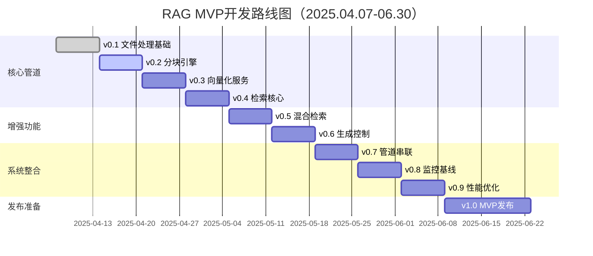
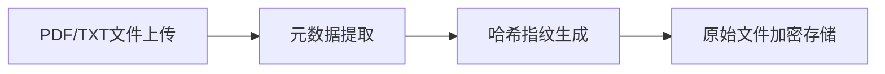
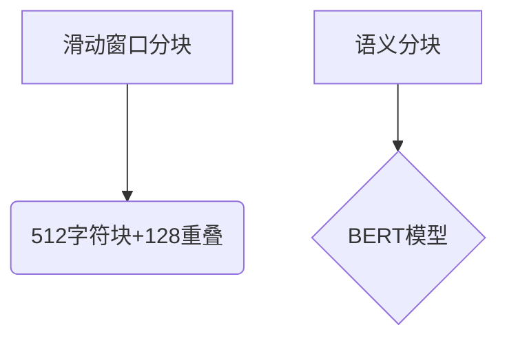
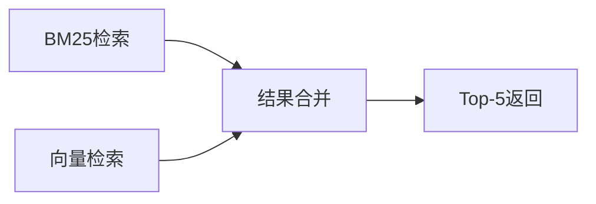
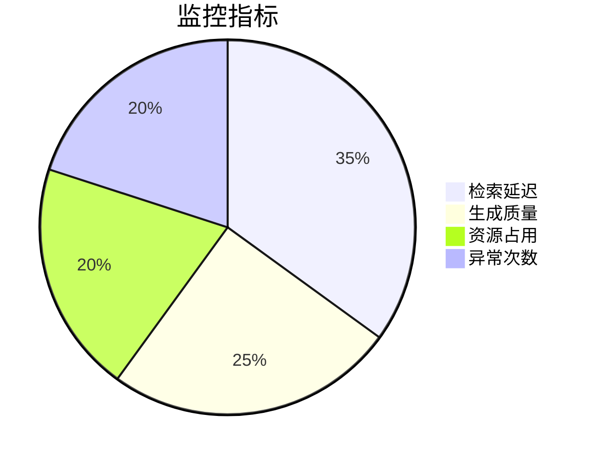
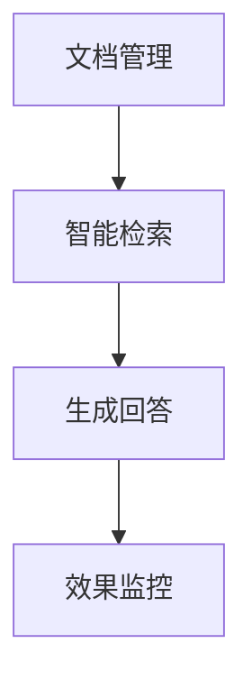

# 版本排期规划

## **迭代规划总览**



---

## **详细版本规划**

### **v0.1.x 文件处理基础（04.07-04.13）**



- 技术选型：Tauri 文件系统 API + SQLite
- 关键指标：支持<50MB 文件处理，元数据字段完整率 100%
- 测试重点：跨平台文件读写兼容性

### **v0.2.x 分块引擎（04.14-04.20）**



- 实现两种分块模式
- 输出分块位置元数据（start/end offset）
- 测试重点：分块边界语义完整性

### **v0.3.x 向量化服务（04.21-04.27）**

- 嵌入模型：BGE-M3 4bit 量化版
- 存储方案：Qdrant 单节点 + 向量快照
- 性能目标：1000 chunks/分钟

### **v0.4.x 检索核心（04.28-05.04）**



- 实现基础检索管道
- 测试重点：Recall@5 >60%

### **v0.5.x 混合检索（05.05-05.11）**

- 权重公式：0.6*向量相似度 + 0.4*BM25
- 支持权重调节 API：/api/search?weight=0.6
- 测试重点：混合检索准确率提升 15%+

### **v0.6.x 生成控制（05.12-05.18）**

```python
# Prompt模板示例
def build_prompt(query, chunks):
    return f"""基于以下上下文：
    {''.join(chunks)}
    请用简洁的中文回答：{query}"""
```

- 集成 Mistral-7B 流式生成
- 响应延迟：首次 Token 时间<2s

### **v0.7.x 管道串联（05.19-05.25）**

- 实现断点续传能力
- 状态监控 API：/api/pipeline/status
- 测试重点：全流程成功率>95%

### **v0.8.x 监控基线（05.26-06.01）**



- 核心监控项：TTFT/TPOT/Recall@5/CPU 负载
- 实现 Prometheus 数据导出

### **v0.9.x 性能优化（06.02-06.08）**

- 索引优化：HNSW+IVF_PQ
- 内存占用降低 40%+
- 压力测试：100 并发请求成功率>90%

---

### **v1.0.0 MVP 发布（06.09-06.22）**



**交付标准**：

1. 支持 PDF/TXT 问答全流程
2. 平均响应时间<3s（不含 LLM 生成）
3. 知识库支持万级 chunks 管理
4. 提供 RESTful API 和基础管理界面

**质量保障**：

- 72 小时稳定性测试（MTBF>200h）
- 安全审计通过 OWASP Top10
- 编写《运维手册》和《API 文档》

---

## **风险控制策略**

1. **技术风险**：保留 OpenAI API 备用方案（当本地模型失效时切换）
2. **进度风险**：每迭代预留 20% buffer 时间
3. **数据风险**：每日自动备份快照至 S3 兼容存储

该规划融合了模块化 RAG 设计思想与企业级开发规范，每个迭代均包含：

- 50%功能开发
- 30%自动化测试
- 20%文档编写

如需具体某迭代的详细任务分解，可提供对应版本的开发说明书。
